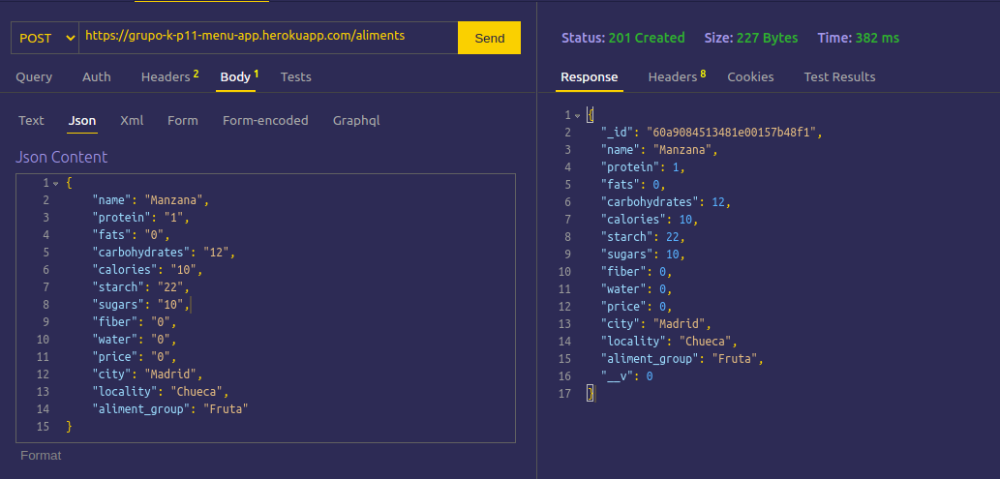
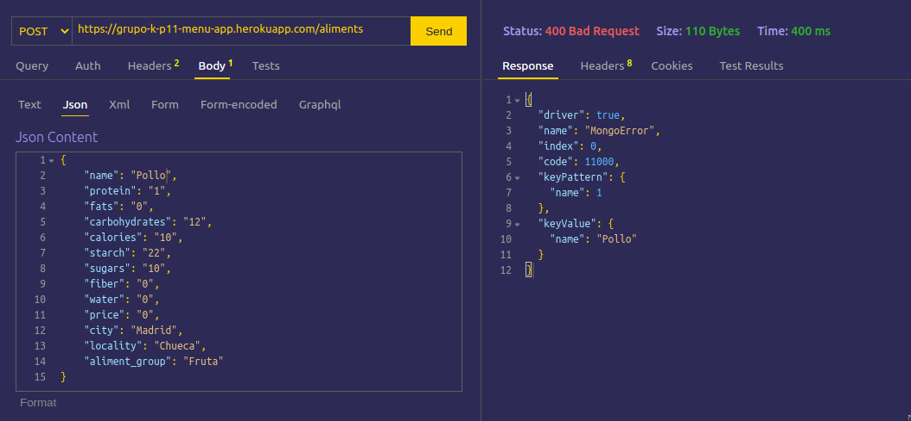
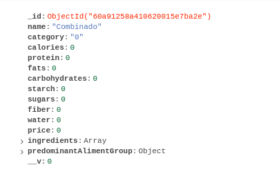
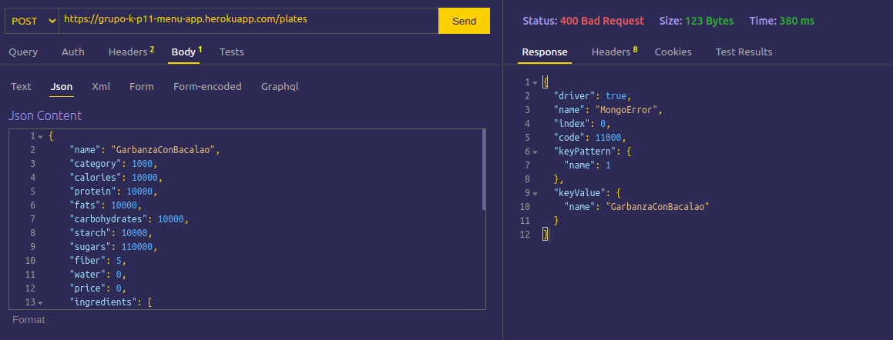
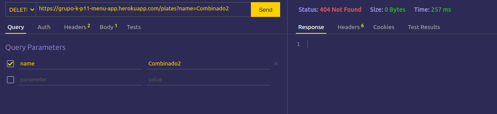
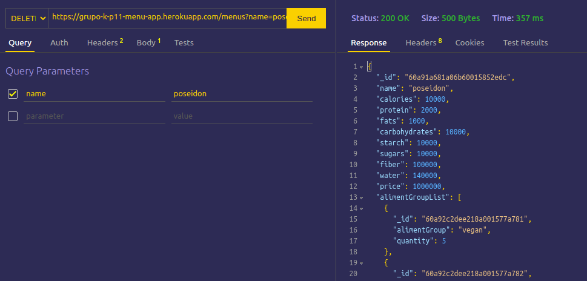

# INFORME - Práctica 11 - API Node/Express de gestión de información nutricional

## Escuela superior de ingeniería informática

### Desarrollo de Sistemas Informáticos

#### Leonardo Dorta Bejarano

#### Elvis Nogueiras

#### José Daniel Fuentes Marra

#### [Enlace al video](https://www.youtube.com/watch?v=4fysho3FjVw)

## Introducción

En esta práctica grupal desarrollaremos una API, haciendo uso de Node/Express, que permita llevar a cabo operaciones de creación, lectura, modificación y borrado (Create, Read, Update, Delete - CRUD) de ingredientes, platos y menús.Utilizando  [Typescript](https://www.typescriptlang.org/)


## Observación

Debido a que la configuracón del [Heroku](https://www.heroku.com/) se realizó con la cuenta del integrante Jose Daniel, y por motivos de tiempo y complicaciones con la plataforma, no pudimos configurar apropiadamente el [Heroku](https://www.heroku.com/) para permitir cuentas multiples. Por esa razón **Se trabajo con SSH a la maquina remota del IaaS de Jose Daniel** para poder así trabajar individualemnte con el Heroku. Por este motivo **La mayoria de los commits van de parte de Jose Daniel**

## Metodología

Para realizar la práctica, y este informe, se uso la siguiente metodología:

Para cada ejercicio:

1. Se configuró apropiadamente el entorno

2. Se realizo el despliegue de la base de datos [MongoDB](https://www.mongodb.com/es) en [Heroku](https://www.heroku.com/), utilizando [MongoDB Atlas](https://www.mongodb.com/es/cloud/atlas) y [MongoDB Compass](https://www.mongodb.com/products/compass)

3. Se restructuró las clases *Menu* *Plate* y *Aliment* de la práctica 7.
  
4. Se reescribio el código de las clases implementadas

5. Se creo el schema y modelo de las clases mediante [Mongoose.js](https://mongoosejs.com/)

6. Se creo mediante [Express](https://expressjs.com/) las rutas necesarias para llevar a cabo el CRUD

7. Se comprobó el correcto funcionamiento del CRUD mediante [ThunderClient](https://marketplace.visualstudio.com/items?itemName=rangav.vscode-thunder-client)

8. Mediante [Inquirer.js](https://www.npmjs.com/package/inquirer) se facilitó la creación, modificación, lectura y actualización de alimentos, menus y platos.

A continuación se explica la realización de la práctica

### Heroku

Para el depliegue de la bbdd, se realizaron los pasos indicados en los apuntes. [Despliegue del API REST](https://ull-esit-inf-dsi-2021.github.io/nodejs-theory/nodejs-deployment.html)
### Recomposición de clases

Utilizando las mismas clases en la práctica 7, se procesdio a cambiar la composición de estas de la siguiente manera.

- **Aliment**:
  


1. Posee un enumerado con los tipos de alimentos disponibles
2. La localización y la ciudad en la clase, no las implementa de una interfaz

- **Plate**:
  


1. Se Elimina la herencia de clases
2. Posee un enumerado con la categoría específica del plato

- **Menu**:


La clase *Menu* no ha sufrido cambios

### Modelos y esquemas Moongose

A continuación se explica lo más relevante de los esquemas y el modelo. Sin embargo se adjuntan los esquemas para mayor profundidad.

- [Aliments](https://github.com/ULL-ESIT-INF-DSI-2021/ull-esit-inf-dsi-20-21-prct11-menu-api-grupo-k/blob/master/src/models/aliments/AlimentsSchema.ts)
- [Plates](https://github.com/ULL-ESIT-INF-DSI-2021/ull-esit-inf-dsi-20-21-prct11-menu-api-grupo-k/blob/master/src/models/plates/PlatesSchema.ts)
- [Menus](https://github.com/ULL-ESIT-INF-DSI-2021/ull-esit-inf-dsi-20-21-prct11-menu-api-grupo-k/blob/master/src/models/menu/MenusSchema.ts)

- **Aliment**:

```ts
 export interface AlimentsInterface extends Document, NutritionalComposition {
    name: string,
    protein: number,
    fats: number,
    carbohydrates: number,
    calories: number,
    starch: number,
    sugars: number,
    fiber: number,
    water: number,
    price: number,
    city: string,
    locality: string,
    aliment_group: AlimentGroup
  }
```

Para el siguiente esquema, el cual es igual a la composición de la clase, se ha definido las restricciones en el siguiente esquemas

1. El nombre del alimento es *unique*, por lo tanto, no habrá 2 alimnetos con el mismo nombre

2. Los valores de la composición nutritional deben ser mayores que 0

3. Todos los campos son requeridos

- **Plate**:

```ts
export interface PlatesInterface extends Document, NutritionalComposition {
    name: string,
    protein: number,
    fats: number,
    carbohydrates: number,
    calories: number,
    starch: number,
    sugars: number,
    fiber: number,
    water: number,
    price: number,
    predominantAlimentGroup: [AlimentGroup, number],
    ingredients: Map<Aliment, number>,
    category: Category
  }
```

Para el esquema de *platos* se presentan los siguiente cambios.

1. Los campos de *predominantAlimentGroup* e *ingredients* se contemplan como subesquemas.

- Para *predominantAlimentGroup*

```ts
 const subPreGroupSchema = new mongoose.Schema({
  alimentGroup: {
    type: String,
    trim: true,
    required: true,
  },
  quantity: {
    type: Number,
    required: true,
  },
});
```

- Para *ingredients*

```ts
const subIngredientsSchema = new mongoose.Schema({
  aliment: {
    type: String,
    trim: true,
    required: true,
  },
  quantity: {
    type: Number,
    required: true,
  },
});
```

2. Todos campos son *required*

3. Los valores de la composición nutritional deben ser mayores que 0

- **Menus**:

```ts
 export interface MenusInterface extends Document, NutritionalComposition {
    name: string,
    plates: Plate[],
    price: number,
    protein: number,
    fats: number,
    carbohydrates: number,
    calories: number,
    starch: number,
    sugars: number,
    fiber: number,
    water:number,
    alimentGroupList : [AlimentGroup, number][];
    verify_menu: boolean;
  }  
```

Menu posee 2 subesquemas

- Para *alimentGroupList*

```ts
 
const subListPreGroupSchema = new mongoose.Schema({
  alimentGroup: {
    type: String,
    trim: true,
    required: true,
  },
  quantity: {
    type: Number,
    required: true,
  },
});
```

- Para *plates*

```ts
const subPlateSchema = new mongoose.Schema({
  plate: {
    type: String,
    trim: true,
    required: true,
  },
});
```

1. El nombre es *unique*

2. Todos campos son *required*

3. Los valores de la composición nutritional deben ser mayores que 0

### Demostración del CRUD

Para realizar las pruebas se utiliza ThunderClient y [MondoDBAtlas](https://www.mongodb.com/products/compass)

Cabe destacar que se utilizan los siguiente opciones para realizar las operaciones

**Create**

- Se escribe en el *body* del JSON el nuevo elemento a crear
**Read**
- Se utiliza una cosulta para obtener el JSON deseado
**Update**
- Se utiliza una consulta para obtener el JSON deseado y se escribe en el cuerpo de JSON los parámetros a modificar
**Delete**
- Se utiliza una cosulta para eliminar el JSON deseado

#### Aliments

 Dado los siguientes alimentos introducidos hasta el momento:\
   

- READ
  - GET 200
  
  - GET 404
  
- CREATE
  - POST 201
  
  
  - POST 404 (al ya estar creado el alimento)
  
- UPDATE

  - PATCH 200
  
  
  - PATCH 404 (al no existir el alimento)
  
  
- DELETE
  - DELETE 200
  
  
    - DELETE 404 (al no existir el alimento)
  

#### Plate

 Dado los siguientes platos introducidos hasta el momento:\
   
   
   

- READ
  - GET 200
  
  - GET 404
  
- CREATE
  - POST 201
  
  
  - POST 404 (al ya estar creado el plato)
  
- UPDATE

  - PATCH 200
  
  
  - PATCH 404 (al no existir el alimento)
  - 
  
- DELETE
  - DELETE 200
  
  
    - DELETE 404 (al no existir el alimento)
  - 

#### Menu

 Dado los siguientes menus introducidos hasta el momento:\
   

- READ
  - GET 200
  
  - GET 404
  
- CREATE
  - POST 201
  
  
  - POST 404 (al ya estar creado el plato)
  
- UPDATE

  - PATCH 200
  
  
  - PATCH 404 (al no existir el alimento)
  - 
  
- DELETE
  - DELETE 200
  
  
    - DELETE 404 (al no existir el alimento)
  - 

### Inquirer.JS

Como implemetación adicional, hemos incluido Inquierer.js a la práctica, realizando la peticiones a través de este. Una demostración se podrá demostrar en el video, en el [min 9:36](https://www.youtube.com/watch?v=4fysho3FjVw)


### Pruebas Implementadas


### Cubrimiento del Código
 


## Conclusiones

Se ha desarrollado una API, mediante Node/Express, permitiendo asi llevar a cabo operaciones de creación, lectura, modificación y borrado (Create, Read, Update, Delete - CRUD) de ingredientes, platos y menús.

## Problemática

Entre las problematicas encontradas podemos destacar las siguientes:

Al realizar la creación del objeto *Mongoose* mediante las intefaces ya definadas, nuestra esquema presenta una composición de clases, por lo tanto, tuvimos que cambiar la manera en que se guarda la información para ser almacenada en el *MongoDB*, ya que, si guardabamos por ejemplo, toda la información de un alimento, al hacer una operación de *Update* en la base de datos de dicho alimento, tendríamos que replicarla para todos los menus y platos con ese alimento.

## Referencias

- [Práctica 11 - API Node/Express de gestión de información nutricional](https://ull-esit-inf-dsi-2021.github.io/prct11-menu-api/)

- [MongoDB](https://www.mongodb.com/es)

- [Heroku](https://www.heroku.com/)

- [MongoDB Atlas](https://www.mongodb.com/es/cloud/atlas)

- [MongoDB Compass](https://www.mongodb.com/products/compass)

- [Mongoose.js](https://mongoosejs.com/)

- [ThunderClient](https://marketplace.visualstudio.com/items?itemName=rangav.vscode-thunder-client)

- [Express](https://expressjs.com/)

- [Inquirer.js](https://www.npmjs.com/package/inquirer)
